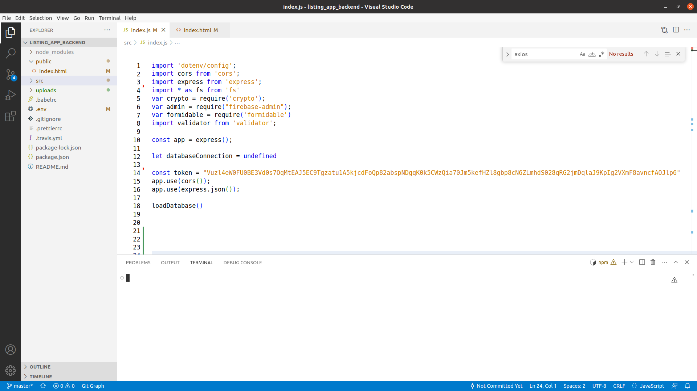

# Listing App Readme

Created: March 16, 2023 7:02 PM

**Database**

Create a schema in mysql called “listing_app” and execute the creation script, you have two a prefilled one and one with the empty database, you will end with something like this (we are using MySQL Workbench):

And after executing it:

**Firebase**

Create a project in firebase so you can use the Firebase auth and replace the following files in the backend

In the frontend the replace the google-services and update the info related to firebase in Info.plist (for IOS) and index.html (for Web)

**Backend**

Put the port in which the app will run and the data related to the database connection in the config file called “.env” in the root folder

You need to make an “npm install” and then a “npm run start”

You can run the dashboard locally for testing purposes, you just need to go (if using the default config) to [http://localhost:3000/public/](http://localhost:3000/public/), but in the production environment is not recommended, we encourage you to use Firebase Storage to host the file and only access it using their interface and renew the access link after each session (we will explain how below)

Before uploading to production make sure to comment:

**Dashboard Section / App Flow**

If you are running locally go to [http://localhost:3000/public/](http://localhost:3000/public/), or if you are using Firebase do as explained in the next section

- Types

Go to the types tab

Click on the “New Type” button

And fill the information, this will be presented as the categories inside the app, the icon is a font awesome icon name (it does not display all of them, just the free ones), the “has” option will show the respective input when creating the item for this type (more about that later) and the “Is Active” controls the display of the category 

Please keep in mind that if you select the “Has Social Network” you need to have at least one social network added into the database as active

Once you’re done you will be allowed to see and edit in the future

- Social Networks

Go to the Social Networks tab

And add the item that you want, the icon field works the same way as in the types section, the base url is an optional field, the idea is that in case that you want to allow the users to add links to social networks (as facebook, twitter, whatsapp) you can use that field to validate if the url that the user is going to enter in the input obeys to that base url, but this validation is up to you to make, the current design of the app allows to go to all the urls that are inserted in the creation input for the social networks, also if keep in mind that it will try to open the respective app if opened in Android, so it can also write predefined messages in whatsapp ([https://faq.whatsapp.com/5913398998672934](https://faq.whatsapp.com/5913398998672934)), you will notice about it later after filling the first article from the app

- **Entities**

Before you run the app in Android Studio put the address of your backend in the url.dart, in this case it was [localhost](http://localhost) so i put my local ip address

Also you can customize your logo by putting one in the assets folder and updating the name of the logo in the welcome_screen.dart, we provide some logos used for the screenshots in the marketplace

To change the color themes we have prepared some default ones, just need to comment and uncomment, but you can also put your own color palette by yourself

Once you are ready, start the emulator and login

Once you enter you will see the types you entered, tap in create publication to add a new entity

You will see the formulary

In the website you need to put a valid full url address, once filled will look like this

After saving to see the publication you will need to aprove it in the admin dashboard

It will look like this

And now you can see it in the app after reloading, also please remember to add the Google Services files in the Flutter app code

You can see the detail

Also if you press in the call, sms or social networks icons (in the bar at the bottom) it will take you there

The edition icon will take you to a screen that looks exactly like creation one and the share button will share this page link using the base url in the url.dart file

**Firebase Dashboard Setup/Production Tips**

If you want to use this app in a production environment we recommend to modify the admin dashboard, if you still want to use it in production as it is before uploading change the token inside the file index.html and index.js, they should match, this is something that should be changed in the future to a real Admin Auth System but it is done this way for simplicity

Keep in mind that because this token is inside of the frontend we are going to only allow the access to the index.html throught the Firebase Storage so it will not be accessed by the public and it should not be uploaded to the open internet, also when uploading the backend remember to remove the index.html from the public folder and comment as instructed before

Also you will need to add the base url to the axios calls if you are not using localhost

Once you are done upload the file called index.html in the Storage section in firebase

It will look like this

If you click in the name link it will open in a new tab

Notice that in the url the token is the same that appeared in the previous screen

Once you’re done modying go to the firebase panel and click in revoke

That will renew the token and next time you open the link name it will be the new one

After ending each session always revoke the token, this way if someone makes a copy of the link it will not have access to the dashboard before the token was refreshed, in the same way if you want to share temporal access to the dashboard you can just share the link and revoke the token after everything is done